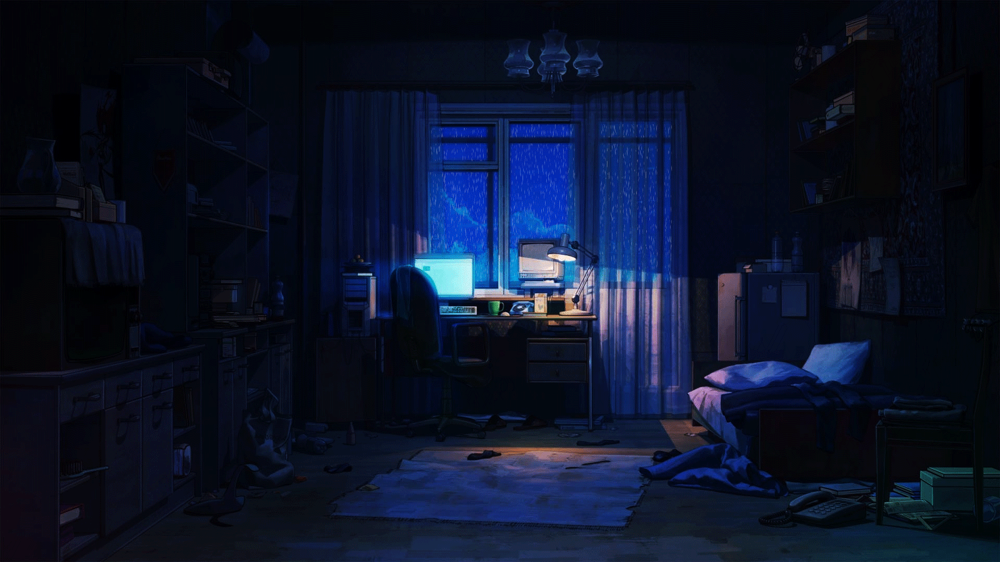

### 🧠 About Me

Hey! I’m Shivansh 👋 — a curious mind who loves building cool stuff with 🐍 Python.  
Currently exploring the worlds of ☁️ **cloud computing** and 📊 **data science**, one project at a time.  
I enjoy solving problems, learning new tools, and turning ideas into reality through code 💡💻  
When I’m not debugging or sipping chai, I’m editing films on 🎬 [@illustrious_films](https://instagram.com/illustrious_films).  
Let’s connect and create something awesome! 📩 **shivanshg005@gmail.com**

# 💻 Tech Stack:

#### 🧠 Languages & Scripting

#### 🐧 OS & Tools

#### 🐳 Containers

#### 🧰 IDEs & Notebooks

# 📊 GitHub Stats:
 
 

## 🏆 GitHub Trophies

---

<picture>
  <source media="(prefers-color-scheme: dark)" srcset="https://raw.githubusercontent.com/SFG006/SFG006/output/github-snake-dark.svg" />
  <source media="(prefers-color-scheme: light)" srcset="https://raw.githubusercontent.com/SFG006/SFG006/output/github-snake.svg" />
  
</picture>
